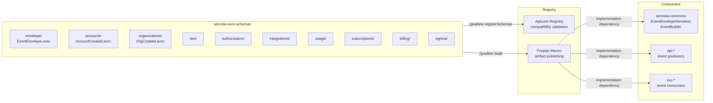

# servista-avro-schemas

Centralized Avro schema repository for the Servista platform — the single source of truth for all domain event contracts. Contains the EventEnvelope wrapper schema and per-domain payload schemas, with generated Java classes published to Forgejo Maven registry. Includes a Gradle task for registering schemas in Apicurio Registry with compatibility validation.



## Schema Organization

Schemas are organized by domain, mapping 1:1 to Kafka topic domains (ADR-012):

```
src/main/avro/
├── envelope/           → servista.envelope (FULL compatibility)
│   └── EventEnvelope.avsc
├── accounts/           → servista.accounts.events (BACKWARD compatibility)
│   └── AccountCreated.avsc
├── organizations/      → servista.organizations.events (BACKWARD)
│   └── OrgCreated.avsc
├── iam/                → servista.iam.events (BACKWARD)
├── authorization/      → servista.authorization.events (BACKWARD)
├── integrations/       → servista.integrations.events (BACKWARD)
├── usage/              → servista.usage.events (BACKWARD)
├── subscriptions/      → servista.subscriptions.events (BACKWARD)
├── billing/            → servista.billing.events (BACKWARD)
└── egress/             → servista.egress.events (BACKWARD)
```

Generated classes use the `eu.servista.schemas.avro.{domain}` package namespace.

## Usage

### Depend on generated classes

```kotlin
// build.gradle.kts
dependencies {
    implementation("eu.servista:servista-avro-schemas:0.1.0")
}
```

For local development with `includeBuild`:

```kotlin
// settings.gradle.kts
includeBuild("../servista-avro-schemas")
```

### Build

```bash
./gradlew build
```

Runs Avro codegen, compiles generated Java classes, and executes all tests (namespace consistency + schema compatibility).

### Register schemas in Apicurio

```bash
./gradlew registerSchemas -PregistryUrl=http://localhost:8080
```

The `-PregistryUrl` flag is required — there is no default to prevent accidental production writes. The task discovers all `.avsc` files, creates Apicurio groups with appropriate compatibility rules, and registers each schema.

### Publish to Forgejo Maven

```bash
./gradlew publish -PforgejoUser=<user> -PforgejoToken=<token>
```

## Adding a New Event Schema

1. Create `src/main/avro/{domain}/{EventName}.avsc` with namespace `eu.servista.schemas.avro.{domain}`
2. Run `./gradlew build` — the namespace consistency test will catch mismatches
3. The compatibility test validates that new schema versions are backward-compatible
4. Commit, publish, and register

## Compatibility Rules

| Scope | Rule | Effect |
|-------|------|--------|
| `servista.envelope` | FULL | New versions must be both forward and backward compatible |
| All domain groups | BACKWARD | New versions must be readable by old consumers |

## Infrastructure Dependencies

| Dependency | Purpose |
|------------|---------|
| **gradle-platform** | Convention plugins (`servista.library`, `servista.avro`, `servista.testing`) and version catalog |
| **Apicurio Registry** | Schema storage and compatibility validation |
| **Forgejo Maven** | Artifact publishing for consumer repos |
